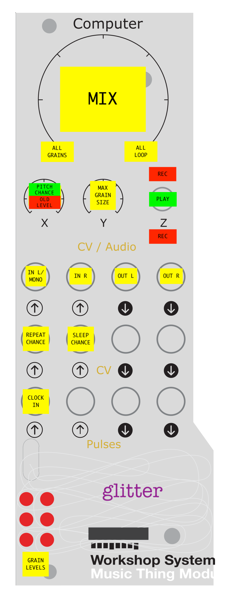

# Glitter

A two second sampler with stereo granulated playback for the Music Thing Modular Workshop System Computer.

## Note

Glitter runs at a 160MHz clock speed. Since Pico SDK 2.1.1 this is no longer considered to be overclocked
but I thought the speed bump was worth pointing out.

## Summary

* The loop is always playing. It will record the audio from the inputs when the switch is up or down.

* Up to six grains are playing small random snippets of the loop. Their behaviour can be affected by the X/Y knobs and CV inputs, but they can't be completely controlled.

## Cheat Sheet

## Controls

**Z Switch**: Switch up or down to record to the loop.

The "Up" position is a useful hands-free continual record mode in which the grains will play back snippets
from the previous two recorded seconds.

The "Down" position is good for punch in/out style recording. e.g. patch one oscillator's output to
the left audio input, and the other oscillator's output to the right input. Pick a couple of frequencies
and flick the X switch down. A brief snippet of the output will be recorded to the loop, overwriting what
was there before. Rinse and repeat.

NB. There is no dry or monitor output from glitter but you could patch that using stackables.

---

**Main Knob**: Fade between the plain loop (fully clockwise) and the granulated output (fully anti-clockwise).

---

**X Knob**: Modify the chance of grains playing back an octave higher or an octave lower. Ranges from
zero chance (fully anti-clockwise) to maximum chance (fully clockwise). NB grains will only re-pitch 
if they can safely do so without tripping over the write head, so at longer lengths there won't
be as much re-pitching.

---

**Y Knob**: Modify the maximum grain size. Clockwise is longer, anti-clockwise is shorter.

---

**CV1 in**: Modify the chance of the grains repeating themselves. Chance is maximum at 0V and decreases with
more positive voltage.

---

**CV2 in**: Modify the chance of the grains going to sleep.  Chance is maximum at 0V and decreases with
more positive voltage.

---

**Pulse 1 in**: With a steady clock input the grains' length and position shall be roughly quantised.

---

**LEDs**: Each LED shows the current level of a grain's output. Six LEDs, six grains - nice!

## Credits

Thanks to Tom Whitwell for the amazing Music Thing Modular Workshop System.

Thanks to Chris Johnson for the excellent Utility-Pair examples.

Thanks to the discord community of computer card creators who inspired me to have a go at this.  